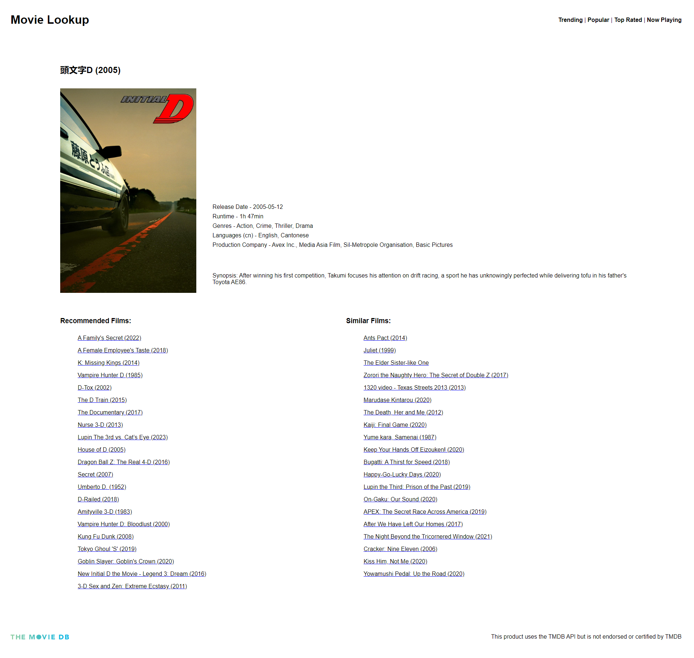

  # Movie Lookup
    
    
  This application usees Vue.js and the TMDB API to host a simple movie search application. Users can search for movies by name, view extended details for a specific movie, view recommended and similar movies to search results, and view trending, popular, top-rated, and now-playing films.
  
  ## Table of Contents
  
  * [Installation](#installation)
  * [Built With](#built)
  * [Usage Information](#usage)
  * [Authors & Acknowledgements](#credits)
  * [License](#license)
  * [Contact](#questions)
  
  ## Built With
  * Vue.js 2
  * Vue CLI
  * Vue Router
  * Axios
  * TMDB API
  
  ## Installation
  For local use, after cloning, create a .env file containing your TMDB api key, then type "npm run serve" to start the server. This application is also available at the live link.
  
  ## Usage Information
  <!-- [Movie Lookup]("")  -->
    
  This application is a simple movie search website. 
    
    
  
  ## Authors & Acknowledgements
  Special thanks to: 
  Dan's answer [here](https://stackoverflow.com/questions/66210222/vue-refresh-page-on-param-id-changes-for-the-same-page) on route refreshes 
  RAH's answer [here](https://stackoverflow.com/questions/50828904/using-environment-variables-with-vue-js) on .env variables 
  and Raj's answer [here](https://stackoverflow.com/questions/63526486/vue-router-catch-all-wildcard-not-working) on wildcard routing
   
   
  This product uses the TMDB API but is not endorsed or certified by TMDB.
  
  Made by [TOVTC](https://github.com/TOVTC).
  
  ## License
  This application uses the MIT License. For more information regarding usage, please visit [this link](https://opensource.org/licenses/MIT).
    
  ## Questions?
  Contact repository author via [GitHub](https://github.com/TOVTC). 
    